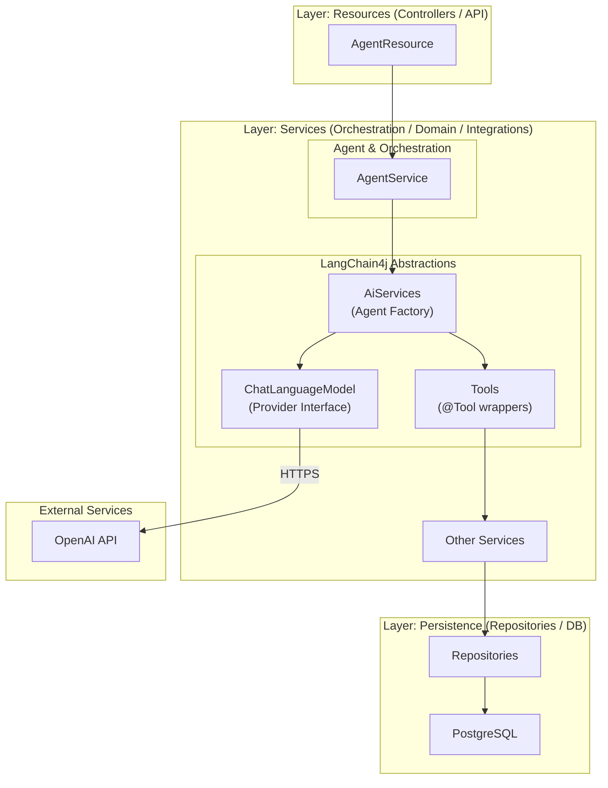
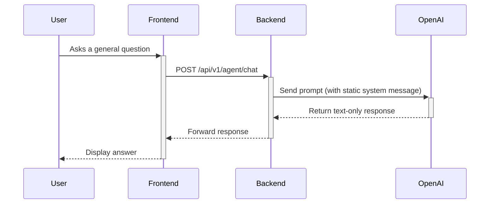
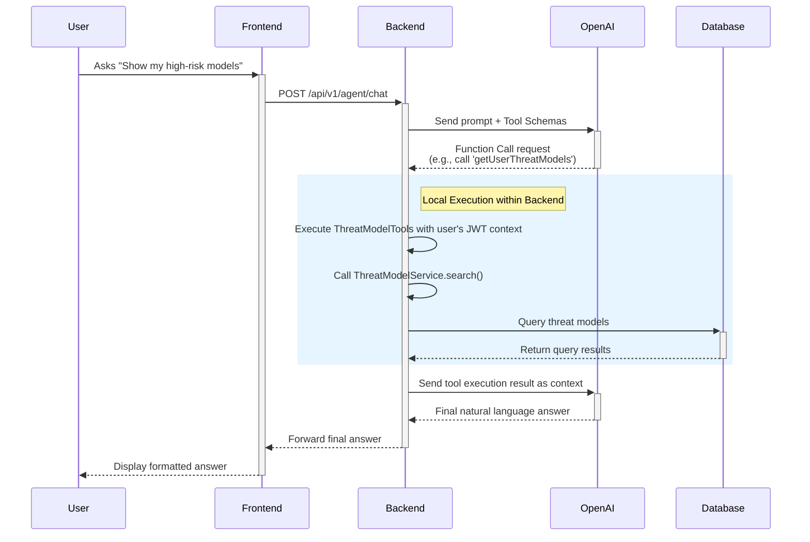

# **LLM Assistant: Architectural High-Level Design**

## 1. Introduction

This document outlines the architectural design for integrating a Large Language Model (LLM)-powered assistant into the Risk & Threat Modelling Platform (RTMP). The objective is to create a secure, scalable, and intelligent chatbot that enhances the user experience by providing contextual help and data-driven insights.

The architecture is designed for a two-phase rollout, using **LangChain4j** for LLM orchestration within the existing **Spring Boot** backend, initially connecting to the **OpenAI** provider.

*   **Phase 1 (Static Knowledge Assistant)**: An informational chatbot explaining the platform features and navigation, without accessing user data.
*   **Phase 2 (Endpoint-Aware Assistant)**: An assistant with secure, read-only access to the user's data, providing detailed information about the user's threats, threat models, components, and vulnerabilities.

## 2. Architectural Principles

*   **Security First**: The user's authentication context (JWT) must never be exposed to the LLM or any external third party. All data access must be governed by existing security policies.
*   **Separation of Concerns**: LLM-specific logic (prompting, tool definition, provider communication) will be isolated from the core business logic (services, repositories).
*   **Provider Agnostic**: The design will abstract the LLM provider, allowing for a future switch from OpenAI to a self-hosted model (e.g., Ollama) with minimal code changes.
*   **Incremental Rollout**: The architecture will be deployed in phases, controlled by feature flags, to mitigate risk and gather user feedback.

## 3. Component Architecture

The new LLM components will be integrated into the existing 3-tier architecture, residing entirely within the backend service.


*   **AgentResource**: A new REST controller exposing `/api/v1/agent/chat`.
*   **AgentService**: The core orchestration service using LangChain4j.
*   **LangChain4j Components**:
    *   **`ChatLanguageModel`**: An interface for the LLM provider (OpenAI).
    *   **`Tools`**: Spring components that wrap our existing services, making them available to the LLM.
    *   **`AiServices`**: A factory that binds the model, tools, and memory together.

## 4. Phase 1: Static Knowledge Assistant - Data Flow

In this phase, the assistant functions as a stateless, informational guide.



**Key Characteristics**:

*   **No Database Access**: The flow does not interact with repositories or services that handle user-specific data.
*   **Stateless Knowledge**: The assistant's knowledge is derived entirely from a pre-configured `@SystemMessage`.
*   **Low Risk**: This phase is safe as no user data is processed.

## 5. Phase 2: Endpoint-Aware Assistant - Secure Data Flow

This phase empowers the assistant with secure, read-only access to user data via the ["Tool-use" pattern](https://microsoft.github.io/ai-agents-for-beginners/04-tool-use/). The LLM requests a tool execution, which the backend performs locally and sends back to the LLM.



### Security Model Highlights

*   **Local Execution**: The tool execution (the boxed section) happens **entirely within the backend**. OpenAI never accesses the internal network or database.
*   **JWT Propagation**: The tool method is executed within the security context of the authenticated user, ensuring all downstream service calls are properly authorized.
*   **No Credential Exposure**: The LLM only receives the names and schemas of the tools, never API keys, JWTs, or database credentials.

## 6. Configuration and Deployment

### Dependencies

Add LangChain4j dependencies to `pom.xml`:

```xml
<properties>
    <langchain4j.version>0.35.0</langchain4j.version>
</properties>

<dependencies>
    <!-- LangChain4j Spring Boot Starter -->
    <dependency>
        <groupId>dev.langchain4j</groupId>
        <artifactId>langchain4j-spring-boot-starter</artifactId>
        <version>${langchain4j.version}</version>
    </dependency>

    <!-- OpenAI Provider -->
    <dependency>
        <groupId>dev.langchain4j</groupId>
        <artifactId>langchain4j-open-ai</artifactId>
        <version>${langchain4j.version}</version>
    </dependency>
</dependencies>
```

### Environment Configuration

Configure OpenAI in `application-dev.properties`:

```properties
# LLM Configuration
langchain4j.open-ai.chat-model.api-key=${OPENAI_API_KEY}
langchain4j.open-ai.chat-model.model-name=gpt-4-turbo-preview
langchain4j.open-ai.chat-model.temperature=0.7
langchain4j.open-ai.chat-model.max-tokens=2000
langchain4j.open-ai.chat-model.log-requests=true
langchain4j.open-ai.chat-model.log-responses=true
```

## 7. Implementation Examples

### Phase 1: AgentService with Static Knowledge

```java
@Service
public class AgentService {
    private final ChatLanguageModel chatModel;

    // Define assistant personality via interface annotation
    interface Assistant {
        @SystemMessage("""
            You are the RTMP Security Assistant.
            Help users understand threat modeling, STRIDE methodology,
            and platform features. No access to user-specific data.
            """)
        String chat(String userMessage);
    }

    public String processMessage(String userMessage, String userId) {
        // Build assistant with LangChain4j
        Assistant assistant = AiServices.builder(Assistant.class)
            .chatLanguageModel(chatModel)
            .chatMemory(MessageWindowChatMemory.withMaxMessages(10))
            .build();

        return assistant.chat(userMessage);
    }
}
```

### Phase 1: AgentResource REST Controller

```java
@RestController
@RequestMapping("/api/v1/agent")
public class AgentResource {
    private final AgentService agentService;

    @PreAuthorize("hasRole('threatmodel:read')")
    @PostMapping("/chat")
    public ResponseEntity<ApiResponse<String>> chat(
            @RequestBody String userMessage,
            @AuthenticationPrincipal Jwt jwt) {
        
        String response = agentService.processMessage(
            userMessage, 
            jwt.getSubject()
        );
        
        return ResponseEntity.ok(ApiResponse.success(response));
    }
}
```

### Phase 2: Tool Components for Data Access

#### ThreatModelTools

```java
@Component
public class ThreatModelTools {
    private final ThreatModelService threatModelService;

    @Tool("Retrieves the user's threat models with optional filtering")
    public List<String> getUserThreatModels(
            @P("Search term") String search,
            @P("Filter: ALL, HIGH_RISK_THREATS, ACTIVE_THREATS") String filter) {
        
        // Executes with user's JWT context automatically
        List<ThreatModel> models = threatModelService.searchThreatModels(
            search, 
            ThreatModelFilter.valueOf(filter)
        );
        
        return models.stream()
            .map(m -> formatModelSummary(m))
            .collect(Collectors.toList());
    }

    @Tool("Gets statistics for a specific threat model")
    public String getThreatModelStats(@P("Threat model UUID") String id) {
        ThreatModelStatsDTO stats = threatModelService.getThreatModelStats(
            UUID.fromString(id)
        );
        
        return formatStats(stats);
    }
}
```

#### ComponentTools

```java
@Component
public class ComponentTools {
    private final ComponentService componentService;

    @Tool("Lists all components in a specific threat model")
    public List<String> getModelComponents(@P("Threat model UUID") String modelId) {
        List<Component> components = componentService.getComponentsByThreatModelId(
            UUID.fromString(modelId)
        );
        
        return components.stream()
            .map(c -> formatComponentSummary(c))
            .collect(Collectors.toList());
    }

    @Tool("Gets detailed information about a specific component")
    public String getComponentDetails(@P("Component UUID") String componentId) {
        Component component = componentService.getComponentById(
            UUID.fromString(componentId)
        );
        
        return formatComponentDetails(component);
    }
}
```

#### VulnerabilityTools

```java
@Component
public class VulnerabilityTools {
    private final VulnerabilityService vulnerabilityService;

    @Tool("Lists all vulnerabilities for a specific component")
    public List<String> getComponentVulnerabilities(
            @P("Component UUID") String componentId) {
        
        List<Vulnerability> vulnerabilities = 
            vulnerabilityService.getVulnerabilitiesByComponentId(
                UUID.fromString(componentId)
            );
        
        return vulnerabilities.stream()
            .map(v -> formatVulnerabilitySummary(v))
            .collect(Collectors.toList());
    }

    @Tool("Gets detailed information about a vulnerability including CVE")
    public String getVulnerabilityDetails(@P("Vulnerability UUID") String id) {
        Vulnerability vulnerability = vulnerabilityService.getVulnerabilityById(
            UUID.fromString(id)
        );
        
        return formatVulnerabilityDetails(vulnerability);
    }
}
```

### Phase 2: Enhanced AgentService with All Tools

```java
@Service
public class AgentService {
    private final ChatLanguageModel chatModel;
    private final ThreatModelTools threatModelTools;
    private final ComponentTools componentTools;
    private final VulnerabilityTools vulnerabilityTools;

    public String processMessage(String userMessage, String userId) {
        var builder = AiServices.builder(Assistant.class)
            .chatLanguageModel(chatModel)
            .chatMemory(MessageWindowChatMemory.withMaxMessages(10));

        // Phase 2: Register all tools for comprehensive data access
        builder.tools(threatModelTools, componentTools, vulnerabilityTools);

        return builder.build().chat(userMessage);
    }
}
```
