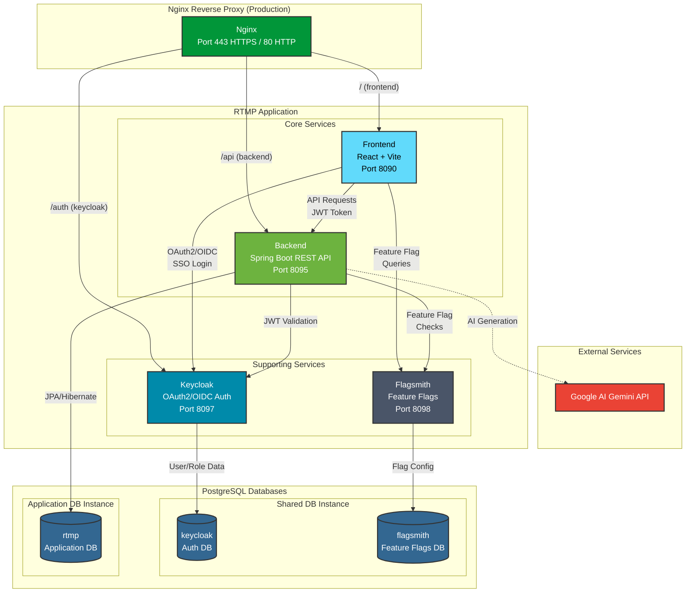
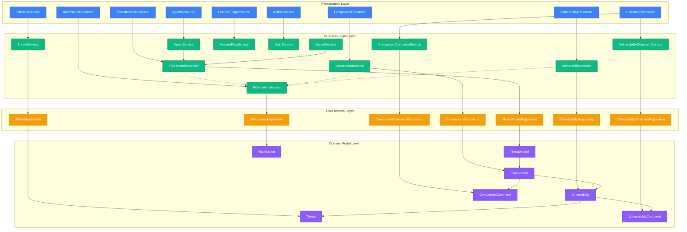
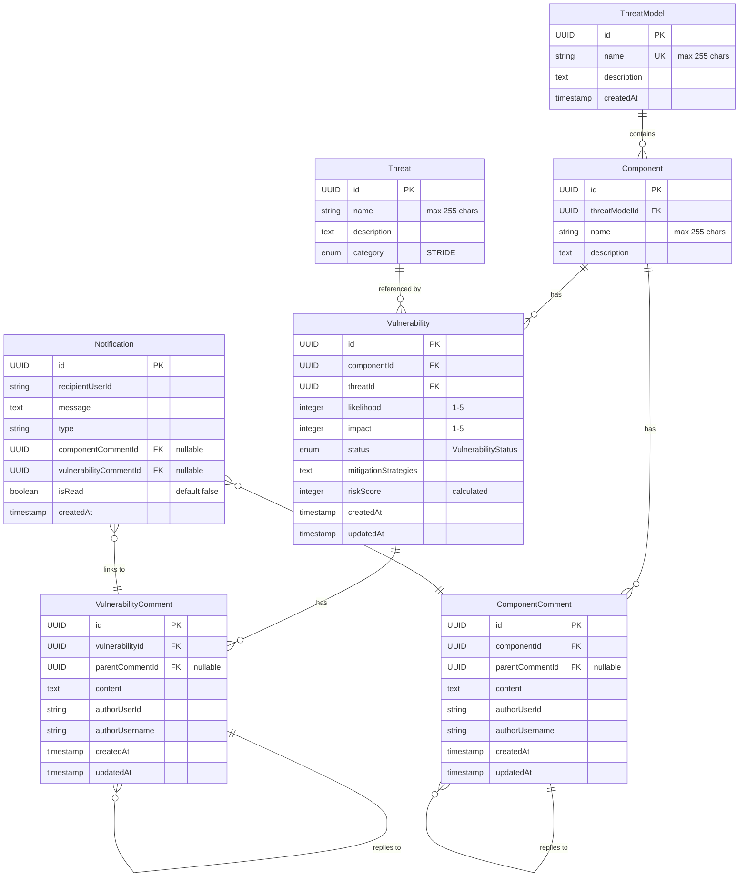
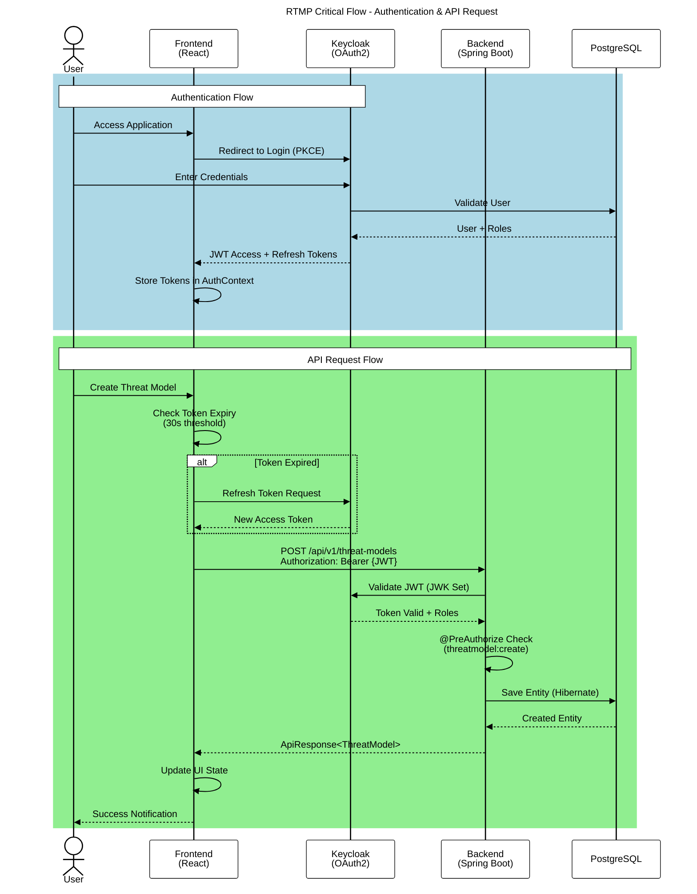

# Risk & Threat Modelling Platform (RTMP)

A collaborative platform for systematically identifying, assessing, and mitigating security threats using the STRIDE framework throughout the software development lifecycle.

### Group 105 Members

| NMec | Name | Email | Role |
|:---:|:---|:---:|:---:|
| 104179 | EDUARDO JOSÉ MENESES ALVES  | eduardoalves@ua.pt | Service Analyst, Developer |
| 103162 | MIGUEL GONÇALVES MARQUES | miguelgoncalvesmarques@ua.pt | Product Owner, Developer |
| 107322 | BERNARDO DE ALMEIDA MARUJO | bernardomarujo@ua.pt | DevOps Engineer, Developer |
| 98584 | AFONSO SILVA CASTANHETA | castanheta@ua.pt | Scrum Master, Developer |
| 98620 | PEDRO DUARTE SOARES FERREIRA | pedrodsf@ua.pt | QA Engineer, Developer |


## Table of Contents
<!-- vscode-markdown-toc -->
* 1. [Overview](#Overview)
* 2. [Personas](#Personas)
	* 2.1. [Persona 1: Sarah Chen - Security Architect/Analyst](#Persona1:SarahChen-SecurityArchitectAnalyst)
		* 2.1.1. [Background](#Background)
		* 2.1.2. [Goals](#Goals)
		* 2.1.3. [Challenges](#Challenges)
		* 2.1.4. [Technical Proficiency](#TechnicalProficiency)
		* 2.1.5. [Usage Patterns](#UsagePatterns)
		* 2.1.6. [Key Features](#KeyFeatures)
	* 2.2. [Persona 2: Mike Rodriguez - Software Developer](#Persona2:MikeRodriguez-SoftwareDeveloper)
		* 2.2.1. [Background](#Background-1)
		* 2.2.2. [Goals](#Goals-1)
		* 2.2.3. [Challenges](#Challenges-1)
		* 2.2.4. [Technical Proficiency](#TechnicalProficiency-1)
		* 2.2.5. [Usage Patterns](#UsagePatterns-1)
		* 2.2.6. [Key Features](#KeyFeatures-1)
	* 2.3. [Persona 3: Jennifer Park - Project Manager](#Persona3:JenniferPark-ProjectManager)
		* 2.3.1. [Background](#Background-1)
		* 2.3.2. [Goals](#Goals-1)
		* 2.3.3. [Challenges](#Challenges-1)
		* 2.3.4. [Technical Proficiency](#TechnicalProficiency-1)
		* 2.3.5. [Usage Patterns](#UsagePatterns-1)
		* 2.3.6. [Key Features](#KeyFeatures-1)
	* 2.4. [Persona 4: David Thompson - Auditor/Compliance Officer](#Persona4:DavidThompson-AuditorComplianceOfficer)
		* 2.4.1. [Background](#Background-1)
		* 2.4.2. [Goals](#Goals-1)
		* 2.4.3. [Challenges](#Challenges-1)
		* 2.4.4. [Technical Proficiency](#TechnicalProficiency-1)
		* 2.4.5. [Usage Patterns](#UsagePatterns-1)
		* 2.4.6. [Key Features](#KeyFeatures-1)
	* 2.5. [Summary Matrix](#SummaryMatrix)
	* 2.6. [Design Implications](#DesignImplications)
* 3. [Core User Stories](#CoreUserStories)
	* 3.1. [1. Authentication & Authorization](#AuthenticationAuthorization)
	* 3.2. [2. Threat Model Management](#ThreatModelManagement)
	* 3.3. [3. Component Management](#ComponentManagement)
	* 3.4. [4. Threat Library](#ThreatLibrary)
	* 3.5. [5. Vulnerability Assessment](#VulnerabilityAssessment)
	* 3.6. [6. Comments & Collaboration](#CommentsCollaboration)
	* 3.7. [7. Notifications](#Notifications)
	* 3.8. [8. AI Assistant (Chatbot)](#AIAssistantChatbot)
	* 3.9. [9. Feature Flags](#FeatureFlags)
* 4. [System Architecture](#SystemArchitecture)
	* 4.1. [High-Level System Architecture](#High-LevelSystemArchitecture)
	* 4.2. [Backend Architecture](#BackendArchitecture)
	* 4.3. [Information Model](#InformationModel)
	* 4.4. [Critical User Interaction Flow](#CriticalUserInteractionFlow)
* 5. [Development](#Development)
	* 5.1. [Setup](#Setup)
		* 5.1.1. [Requirements](#Requirements)
		* 5.1.2. [Initial Setup](#InitialSetup)
	* 5.2. [Test Users](#TestUsers)
	* 5.3. [Continuous Integration](#ContinuousIntegration)
	* 5.4. [Publishing New Container Images](#PublishingNewContainerImages)
	* 5.5. [Keycloak Configuration](#KeycloakConfiguration)
		* 5.5.1. [What the Script Configures](#WhattheScriptConfigures)
		* 5.5.2. [Usage](#Usage)
		* 5.5.3. [Implementation](#Implementation)
	* 5.6. [Flagsmith Configuration](#FlagsmithConfiguration)
		* 5.6.1. [What the Script Configures](#WhattheScriptConfigures-1)
		* 5.6.2. [Usage](#Usage-1)
		* 5.6.3. [Implementation](#Implementation-1)
	* 5.7. [Production Environment](#ProductionEnvironment)
		* 5.7.1. [Requirements](#Requirements-1)
		* 5.7.2. [Initial Setup](#InitialSetup-1)
		* 5.7.3. [Updating Application](#UpdatingApplication)

<!-- vscode-markdown-toc-config
	numbering=true
	autoSave=true
	/vscode-markdown-toc-config -->
<!-- /vscode-markdown-toc -->

##  1. <a name='Overview'></a>Overview

RTMP enables teams to create **threat models** that represent security analyses of software systems. Each threat model contains **components** (such as web servers, databases, or API gateways) that can be associated with multiple **vulnerabilities**. Vulnerabilities link specific threats from a STRIDE library to components, with each vulnerability being automatically scored using a risk matrix (likelihood × impact), enabling teams to prioritize mitigation efforts effectively.

##  2. <a name='Personas'></a>Personas

###  2.1. <a name='Persona1:SarahChen-SecurityArchitectAnalyst'></a>Persona 1: Sarah Chen - Security Architect/Analyst

####  2.1.1. <a name='Background'></a>Background
- **Age**: 35
- **Job Title**: Senior Security Architect
- **Experience**: 10 years in cybersecurity, 5 years in application security
- **Education**: Master's degree in Computer Science with a focus on Cybersecurity
- **Organization**: Mid-sized financial services company

####  2.1.2. <a name='Goals'></a>Goals
- Create and manage threat models for new and existing systems
- Identify potential security vulnerabilities early in the Software Development Lifecycle (SDLC)
- Quickly query system-wide security data and statistics
- Apply established security frameworks (STRIDE, OWASP Top 10) systematically
- Generate security requirements and mitigation strategies for development teams
- Maintain a centralized repository of all security-related design decisions

####  2.1.3. <a name='Challenges'></a>Challenges
- Managing multiple threat models across different projects simultaneously
- Ensuring consistency in threat identification across the organization
- Communicating complex security concepts to non-technical stakeholders
- Keeping threat models up-to-date as systems evolve
- Demonstrating security compliance to auditors

####  2.1.4. <a name='TechnicalProficiency'></a>Technical Proficiency
- **High**: Experienced with security frameworks, threat modeling methodologies, and security tools
- Comfortable with technical diagramming and architectural modeling

####  2.1.5. <a name='UsagePatterns'></a>Usage Patterns
- Creates 3-5 new threat models per month
- Spends 2-3 hours per day reviewing and updating existing models
- Collaborates with development teams during sprint planning
- Generates reports for quarterly security reviews

####  2.1.6. <a name='KeyFeatures'></a>Key Features
- Form-based interface for creating and managing threat models
- Built-in STRIDE threat library with predefined threats
- Risk assessment with likelihood and impact scoring
- Vulnerability tracking with mitigation notes and status management
- Component-based architecture modeling
- AI assistant for quick data retrieval and platform guidance
- Filtering and search capabilities across threat models, components, and vulnerabilities


###  2.2. <a name='Persona2:MikeRodriguez-SoftwareDeveloper'></a>Persona 2: Mike Rodriguez - Software Developer

####  2.2.1. <a name='Background-1'></a>Background
- **Age**: 28
- **Job Title**: Full Stack Developer
- **Experience**: 5 years in software development
- **Education**: Bachelor's degree in Software Engineering
- **Organization**: E-commerce platform company

####  2.2.2. <a name='Goals-1'></a>Goals
- Understand security threats relevant to features being developed
- Implement secure code based on identified mitigation strategies
- Consult existing threat models to avoid introducing new vulnerabilities
- Get quick answers to security questions without context switching
- Update threat models when implementing new features or architectural changes
- Learn security best practices applicable to daily development work

####  2.2.3. <a name='Challenges-1'></a>Challenges
- Limited time to focus on security due to feature delivery pressure
- Difficulty understanding complex security terminology and concepts
- Uncertainty about which security controls to implement
- Keeping security considerations in mind while coding
- Balancing security requirements with performance and usability

####  2.2.4. <a name='TechnicalProficiency-1'></a>Technical Proficiency
- **Medium-High**: Strong coding skills but limited security expertise
- Familiar with basic security concepts but not deep threat modeling

####  2.2.5. <a name='UsagePatterns-1'></a>Usage Patterns
- Consults threat models 2-3 times per week when starting new features
- Spends 30-60 minutes reviewing relevant threats and mitigations
- Updates models occasionally when system architecture changes
- Collaborates with security architects during code reviews

####  2.2.6. <a name='KeyFeatures-1'></a>Key Features
- Read-only threat model viewer with component and vulnerability details
- Clear mitigation notes and status tracking (To Do, In Progress, Completed)
- Search and filter functionality across threat models and components
- AI assistant to explain security concepts and find relevant threat data
- Real-time notifications for updates and comments
- Comment system for collaboration on components and vulnerabilities


###  2.3. <a name='Persona3:JenniferPark-ProjectManager'></a>Persona 3: Jennifer Park - Project Manager

####  2.3.1. <a name='Background-1'></a>Background
- **Age**: 42
- **Job Title**: IT Project Manager
- **Experience**: 15 years in project management, 8 years in IT
- **Education**: MBA with PMP certification
- **Organization**: Healthcare technology provider

####  2.3.2. <a name='Goals-1'></a>Goals
- Gain high-level overview of security risks across projects
- Get quick, high-level summaries of project risks using natural language
- Track status of identified threats and mitigation efforts
- Monitor progress of security-related tasks
- Use risk data to inform project timelines and resource allocation
- Report security posture to stakeholders and executives

####  2.3.3. <a name='Challenges-1'></a>Challenges
- Understanding technical security details without deep expertise
- Balancing security requirements with project deadlines and budget
- Communicating security risks to non-technical executives
- Tracking multiple security initiatives across complex projects
- Demonstrating ROI of security investments

####  2.3.4. <a name='TechnicalProficiency-1'></a>Technical Proficiency
- **Low-Medium**: Non-technical background with basic understanding of IT concepts
- Familiar with project management tools but not security-specific platforms

####  2.3.5. <a name='UsagePatterns-1'></a>Usage Patterns
- Reviews project dashboards daily for status updates
- Generates reports weekly for stakeholder meetings
- Spends 1-2 hours per week reviewing high-priority threats
- Uses platform during project planning and risk assessment sessions

####  2.3.6. <a name='KeyFeatures-1'></a>Key Features
- Risk-based vulnerability prioritization (automatically calculated)
- Mitigation status tracking (To Do, In Progress, Completed)
- Search and filter capabilities by component, threat type, or risk level
- Conversational interface for project risk summaries
- Statistical summaries showing vulnerability counts by risk level


###  2.4. <a name='Persona4:DavidThompson-AuditorComplianceOfficer'></a>Persona 4: David Thompson - Auditor/Compliance Officer

####  2.4.1. <a name='Background-1'></a>Background
- **Age**: 48
- **Job Title**: Compliance Officer
- **Experience**: 20 years in risk management and compliance
- **Education**: Bachelor's in Accounting, CISA and CISSP certifications
- **Organization**: Financial services regulatory compliance team

####  2.4.2. <a name='Goals-1'></a>Goals
- Review threat models and security documentation for compliance audits
- Verify that security best practices are being followed
- Use conversational queries to find specific audit evidence quickly
- Ensure adequate documentation of security decisions
- Validate that identified risks are being managed appropriately
- Generate audit reports demonstrating security compliance

####  2.4.3. <a name='Challenges-1'></a>Challenges
- Accessing complete and up-to-date security documentation
- Verifying that security controls are actually implemented
- Ensuring auditability and traceability of security decisions
- Assessing whether risks are properly prioritized and addressed
- Comparing security practices against industry standards

####  2.4.4. <a name='TechnicalProficiency-1'></a>Technical Proficiency
- **Medium**: Strong understanding of security standards and compliance frameworks
- Experienced with audit processes but may not be deeply technical

####  2.4.5. <a name='UsagePatterns-1'></a>Usage Patterns
- Performs detailed reviews quarterly or during compliance audits
- Spends 4-8 hours per audit reviewing threat models and documentation
- Exports comprehensive reports for audit evidence
- Reviews historical changes

####  2.4.6. <a name='KeyFeatures-1'></a>Key Features
- Read-only access to all threat models and vulnerability documentation
- Mitigation status tracking with detailed notes and timestamps
- STRIDE framework categorization for threat classification
- AI-powered search for locating specific compliance and audit data
- Comment history for audit trail of discussions and decisions
- Likelihood, impact, and calculated risk scores for all vulnerabilities


###  2.5. <a name='SummaryMatrix'></a>Summary Matrix

| Persona | Primary Goal | Usage Frequency | Technical Level | Key Pain Point |
|---------|--------------|----------------|-----------------|----------------|
| Sarah (Security Architect) | Create and manage threat models | Daily | High | Managing complexity across multiple projects |
| Mike (Developer) | Implement secure code | 2-3x/week | Medium-High | Understanding security in context of features |
| Jennifer (Project Manager) | Track security risks and progress | Daily | Low-Medium | Translating technical risks to business impact |
| David (Auditor) | Verify compliance and documentation | Quarterly | Medium | Ensuring complete audit trails |


###  2.6. <a name='DesignImplications'></a>Design Implications

Based on these personas, the RTMP provides:

1. **Role-based access control** via Keycloak integration, ensuring users have appropriate permissions (read, create, update, delete) for threat models, components, and vulnerabilities
2. **Collaboration features** including comment systems on components and vulnerabilities, plus real-time notifications for updates
3. **STRIDE-based threat modeling** with a predefined threat library mapped to STRIDE categories
4. **Risk assessment** with automatic risk calculation based on likelihood and impact scores
5. **Mitigation tracking** with status management (To Do, In Progress, Completed) and detailed notes
6. **Search and filtering** capabilities to help users find relevant threats and components quickly
7. **Component-based modeling** allowing users to organize vulnerabilities by system components within threat models
8. **AI Assistant** which provides conversational access to threat model data, explains security concepts, and guides users through the platform


##  3. <a name='CoreUserStories'></a>Core User Stories

###  3.1. <a name='AuthenticationAuthorization'></a>1. Authentication & Authorization
**As a** user, **I want to** securely log in with Keycloak OAuth2/OIDC and have role-based access control, **so that** my actions are restricted to my authorized permissions.

**Context:** The platform implements four distinct roles with different permission levels:
- **Security Architect**: Full CRUD access to all resources (threat models, components, vulnerabilities, threats)
- **Software Developer**: Can create, read, and update threat models and vulnerabilities
- **Project Manager**: Read-only access to view threat models and reports
- **Auditor**: Read-only access for compliance reviews

Authentication uses JWT tokens with automatic silent refresh every 30 seconds. The system prevents unauthorized actions and displays appropriate permission denied messages.

###  3.2. <a name='ThreatModelManagement'></a>2. Threat Model Management
**As a** Security Architect, **I want to** create, view, update, delete, and search threat models with statistical summaries, **so that** I can systematically document security analyses of software systems.

**Context:** Threat models are the top-level container for security analyses. Each model includes a unique name (max 255 characters), detailed description, and automatically tracked creation timestamp. Users can search and filter models by name, description, or threat conditions (active threats, high-risk threats, mitigated threats). The detail view provides statistical summaries including total components, total vulnerabilities, high-risk count, and mitigation status.

###  3.3. <a name='ComponentManagement'></a>3. Component Management
**As a** Security Architect, **I want to** manage system components (web servers, databases, APIs) within threat models, **so that** I can organize vulnerabilities by architectural elements.

**Context:** Components represent individual parts of the system architecture being analyzed (e.g., "Payment Gateway", "User Database", "Authentication Service"). Each component belongs to a single threat model and can have multiple vulnerabilities. Users can create, update, delete, and search components by name or description. Deleting a component cascades to remove all associated vulnerabilities.

###  3.4. <a name='ThreatLibrary'></a>4. Threat Library
**As a** user, **I want to** browse a pre-populated library of STRIDE-categorized threats (Spoofing, Tampering, Repudiation, Information Disclosure, Denial of Service, Elevation of Privilege), **so that** I can select relevant threats to associate with components.

**Context:** The threat library provides a curated collection of common security threats mapped to the STRIDE framework. Each threat includes a name, detailed description, and STRIDE category assignment. Users browse the library when creating vulnerabilities to link standardized threat definitions to specific components. This ensures consistency in threat identification across the organization.

###  3.5. <a name='VulnerabilityAssessment'></a>5. Vulnerability Assessment
**As a** Security Architect, **I want to** create, update, and track vulnerabilities by linking threats to components with likelihood/impact scoring, mitigation strategies, and status management, **so that** I can prioritize security risks effectively using the automated risk matrix.

**Context:** Vulnerabilities represent specific instances where a threat applies to a component. Each vulnerability requires:
- **Threat selection** from the library
- **Component association** within the threat model
- **Likelihood rating** (1-5 scale): How probable is exploitation?
- **Impact rating** (1-5 scale): How severe would the consequences be?
- **Risk score** (automatically calculated as likelihood × impact, ranges 1-25)
- **Risk level** (auto-assigned: Minimal 1-4, Low 5-9, Medium 10-14, High 15-19, Critical 20-25)
- **Status tracking** (IDENTIFIED, INVESTIGATING, MITIGATED, ACCEPTED)
- **Mitigation strategies** (free-text notes on countermeasures)

Users can filter vulnerabilities by risk level and status to focus on priority items.

###  3.6. <a name='CommentsCollaboration'></a>6. Comments & Collaboration
**As a** team member, **I want to** add comments to components and vulnerabilities with threaded discussions, **so that** I can collaborate with colleagues on security decisions and maintain audit trails.

**Context:** The comment system supports asynchronous collaboration between security architects, developers, and project managers. Comments can be attached to both components (for architectural discussions) and vulnerabilities (for mitigation strategies). Each comment includes the author's username, timestamp, and content. Users can reply to comments to create threaded conversations, and delete their own comments (cascade deletes replies). This provides a complete audit trail of security discussions and decisions.

###  3.7. <a name='Notifications'></a>7. Notifications
**As a** user, **I want to** receive real-time notifications for updates and comments on my threat models, **so that** I stay informed of security discussions and changes.

**Context:** The notification system alerts users to relevant activity without requiring constant monitoring. Users receive notifications when someone comments on vulnerabilities or components they created. Notifications appear in a centralized notification center and can be marked as read. This enables timely responses to security discussions and ensures important updates aren't missed.

###  3.8. <a name='AIAssistantChatbot'></a>8. AI Assistant (Chatbot)
**As a** user, **I want to** interact with an AI assistant that can answer questions about STRIDE methodology, platform navigation, and cybersecurity best practices, **so that** I can quickly get guidance without leaving the platform.

**Context:** The AI assistant provides conversational access to platform knowledge and security expertise. It can:
- Explain STRIDE methodology and threat modeling concepts
- Guide users through platform features and navigation
- Answer questions about risk scoring and vulnerability assessment
- Provide cybersecurity best practices and mitigation strategies
- Retrieve threat model data and statistics

Conversations maintain session history, and responses are formatted in Markdown for readability. The assistant helps reduce the learning curve for new users and provides quick answers to security questions.

###  3.9. <a name='FeatureFlags'></a>9. Feature Flags
**As a** system administrator, **I want to** toggle features on/off dynamically using Flagsmith, **so that** I can control feature rollout and experimentation without redeployment.

**Context:** Feature flags enable runtime control over platform capabilities without requiring code deployments. Administrators can enable/disable features for gradual rollouts, A/B testing, or emergency shutdowns. The frontend and backend both query Flagsmith to determine which features are active. This supports safer deployments and allows features to be tested with specific user groups before full release.


##  4. <a name='SystemArchitecture'></a>System Architecture

###  4.1. <a name='High-LevelSystemArchitecture'></a>High-Level System Architecture

The platform is composed of several interconnected layers and services, as illustrated in Figure 1. At the highest level, the system is structured around:

**Core Services:**
- **Frontend Application**: A React-based single-page application built with Vite that serves as the user interface.
- **Backend API**: A Spring Boot RESTful API service that handles all business logic and data operations.
**Supporting Services:**
- **Keycloak**: An OAuth2/OpenID Connect authentication server that manages user identity, authentication flows, and role-based access control.
- **Flagsmith**: A feature flag management service that enables dynamic feature toggling without requiring code deployments.

**Infrastructure Components:**
- **Nginx Reverse Proxy**: In production deployments, Nginx acts as the entry point, routing traffic to appropriate services based on path prefixes (/ for frontend, /api for backend, /auth for Keycloak).
- **PostgreSQL Database Cluster**: Three separate database instances handle data persistence - one for the main application (rtmp), one for Keycloak authentication data (keycloak), and one for Flagsmith configuration (flagsmith).

**External Services:**
- **Google AI Gemini API**: The backend integrates with Google's Gemini AI service to provide an intelligent chat assistant.

The frontend communicates with the backend through JWT-authenticated API requests, while also directly interacting with Keycloak for authentication flows and Flagsmith for feature flag queries. The backend validates all JWT tokens with Keycloak and queries Flagsmith to determine feature availability before processing requests. This architecture ensures that authentication and authorization are consistently enforced across the entire platform.



**Figure 1**: High-level system architecture showing all services, databases, and their interactions

###  4.2. <a name='BackendArchitecture'></a>Backend Architecture

The backend follows a layered architecture pattern with clear separation between presentation, business logic, data access, and domain model layers, as shown in Figure 2. This design promotes maintainability, testability, and adherence to SOLID principles.

**Presentation Layer (Resources):**
The top layer consists of REST controller classes (named with the "Resource" suffix following RESTful conventions). These classes handle HTTP requests and responses:
- `ThreatModelResource`: Manages threat model CRUD operations
- `ComponentResource` and `VulnerabilityResource`: Handle system components and their associated vulnerabilities
- `ThreatResource`: Manages the threat catalog
- `CommentResource`: Handles commenting functionality for both components and vulnerabilities
- `NotificationResource`: Manages user notifications for collaboration features
- `AgentResource`: Interfaces with RTMP AI Assistant
- `FeatureFlagResource` and `AuthResource`: Provide feature flag and authentication utilities

**Business Logic Layer (Services):**
Service classes implement the core business logic and orchestrate operations:
- `ThreatModelService`, `ComponentService`, `VulnerabilityService`, and `ThreatService` implement domain-specific operations
- `ComponentCommentService` and `VulnerabilityCommentService` handle threaded discussions
- `NotificationService` manages real-time collaboration notifications
- `AgentService` integrates with the Google Gemini API for AI-powered features
- `ExportService` handles data export functionality
- `FeatureFlagService` queries Flagsmith for feature availability
- `AuthService` provides authentication utilities

Service inter-dependencies are kept minimal, with services primarily depending on repositories. Exceptions include the notification service, which is used by multiple services to create notifications when entities are modified, and the agent and export services that depend on the ThreatModelService to access threat models.

**Data Access Layer (Repositories):**
Repository interfaces extend Spring Data JPA's `JpaRepository`, providing standard CRUD operations and custom query methods:
- `ThreatModelRepository`, `ComponentRepository`, `VulnerabilityRepository`, `ThreatRepository`
- `ComponentCommentRepository`, `VulnerabilityCommentRepository`
- `NotificationRepository`

These repositories abstract database operations and are automatically implemented by Spring Data JPA at runtime.

**Domain Model Layer (Entities):**
JPA entity classes represent the core domain concepts:
- `ThreatModel`: Root aggregate containing components
- `Component`: System components that can have vulnerabilities
- `Vulnerability`: Security weaknesses linked to components and threats
- `Threat`: Catalog of known threats (typically STRIDE categories)
- `ComponentComment` and `VulnerabilityComment`: Threaded discussion support
- `Notification`: User notifications for collaboration

Entity relationships are managed through bidirectional JPA mappings with cascade operations, ensuring referential integrity. Hibernate automatically generates the database schema based on these entity definitions.



**Figure 2**: Backend layered architecture showing resources, services, repositories, and domain models

###  4.3. <a name='InformationModel'></a>Information Model

The platform's data model, illustrated in Figure 3, follows a hierarchical structure designed for systematic threat analysis.

**Core Entities:**

- **ThreatModel**: Root entity representing a complete security assessment with unique name, description, and timestamp. Contains multiple components.
- **Component**: Represents system parts being analyzed (e.g., "Authentication Service", "User Database"). Each component can have multiple vulnerabilities.
- **Vulnerability**: Captures security weaknesses with quantitative risk metrics (likelihood 1-5, impact 1-5, calculated risk score), status tracking, and mitigation strategies. Links to both a component and a threat type.
- **Threat**: Catalog of threat types organized by frameworks like STRIDE, with name, description, and category.

**Collaboration Entities:**

- **ComponentComment** and **VulnerabilityComment**: Enable threaded discussions with nested replies via self-referential relationships. Store author information from Keycloak.
- **Notification**: Alerts users about new comments on components or vulnerabilities they're tracking, with read/unread status.



**Figure 3**: Entity-relationship diagram showing the information model and database schema

###  4.4. <a name='CriticalUserInteractionFlow'></a>Critical User Interaction Flow

**API Request Flow:**

To wrap up the architecture section, we demonstrate an API Request Flow that is representative of all the others. How authentication and API requests flow through the system, illustrating the collaboration between architectural components. All the following steps can be obserevd in Figure 4:

1. User initiates a "Create Threat Model" action in the frontend.
3. Frontend sends a `POST /api/v1/threat-models` request with the JWT in the `Authorization: Bearer` header.
4. Backend validates the JWT using Keycloak's JWK Set to verify token validity and extract user roles.
5. Backend performs an `@PreAuthorize` check for the `threatmodel:create` role.
6. Upon authorization, the backend saves the entity via Hibernate to PostgreSQL within a transaction.
7. Database returns the created entity to the backend.
8. Backend wraps the entity in an `ApiResponse<ThreatModel>` and sends it to the frontend.
9. Frontend updates its UI state and displays a success notification to the user.

**Security Features:**

The architecture implements token-based stateless authentication, JWT signature validation, role-based access control (RBAC), PKCE for public clients, transparent token refresh, and HTTPS encryption in production—ensuring all platform actions are authenticated and authorized.



**Figure 4**: Sequence diagram showing authentication and API request flow


##  5. <a name='Development'></a>Development

###  5.1. <a name='Setup'></a>Setup
####  5.1.1. <a name='Requirements'></a>Requirements
- [Docker](https://docs.docker.com/get-started/)

####  5.1.2. <a name='InitialSetup'></a>Initial Setup

0. Prepare the environment file
```bash
make prepare-env
```
This will create a copy of `.env-sample` to `.env`

Next, create an account at [Google AI Studio](https://aistudio.google.com/), create a new project, and an API key. Paste this key in the `GOOGLE_AI_GEMINI_API_KEY` variable.

1. Start the `db`, `keycloak`, and `flagsmith`services
```bash
docker compose up -d db keycloak flagsmith
```

> Wait until all services are healthy

2. Run the setup scripts for `keycloak`and `flagsmith`
```bash
./scripts/setup-keycloak.sh --setup-users 'http://localhost:8090'
./scripts/setup-flagsmith-features.sh
```

> After running `setup-flagsmith-features.sh`, the `FLAGSMITH_ENVIRONMENT_KEY` environment variable is updated with the correct value.

3. Run all services
```bash
make upd
```
> Check the `Makefile` for other useful commands.
The frontend has hot-reloading enabled, so code changes are immediately propagated to the UI. For changes in the backend, you need to rebuild the container image.


The following services are now available:
- RTMP: http://localhost:8090
- Swagger API documentation: http://localhost:8095/docs
- Flagsmith:http://localhost:8098
- Keycloak:http://localhost:8097
- pgAdmin: http://localhost:8096

###  5.2. <a name='TestUsers'></a>Test Users

The following test users are available:

| Email | Password | Role |
|:---|:---|:---|
| architect@rtmp.com | `Architect@2024` | Security Architect |
| developer@rtmp.com | `Developer@2024` | Software Developer |
| manager@rtmp.com | `Manager@2024` | Project Manager |
| auditor@rtmp.com | `Auditor@2024` | Auditor |


###  5.3. <a name='ContinuousIntegration'></a>Continuous Integration

The project uses GitHub Actions for continuous integration. On every commit to the repository:

- **Frontend Build**: The React application is automatically built and validated
- **Backend Build**: The Spring Boot application is compiled using Maven
- **Backend Unit Tests**: All JUnit tests are executed with code coverage reporting via Jacoco

These automated checks ensure code quality and catch issues early in the development process. Build and test results are visible in the GitHub Actions tab for each commit.

###  5.4. <a name='PublishingNewContainerImages'></a>Publishing New Container Images

To publish a new backend and frontend container images of the application:

1. Go to GitHub Actions → "CD - Build and Publish Docker Images"
2. Click on the "Run workflow" dropdown
3. Select version bump type (patch/minor/major)
4. To create a release (optional), tick the "Create a GitHub Release" box, and write the release notes
5. Run the workflow


###  5.5. <a name='KeycloakConfiguration'></a>Keycloak Configuration

The `setup-keycloak.sh` script automates the complete Keycloak configuration process.

####  5.5.1. <a name='WhattheScriptConfigures'></a>What the Script Configures

**Realm Setup:**
- Creates the `rtmp` realm with email-based authentication
- Configures the `rtmp-client` public client with PKCE support
- Sets up redirect URIs and CORS settings for the frontend

**Role-Based Access Control:**
The script creates 18 fine-grained realm roles following the `resource:action` pattern:
- **Threat Models**: `threatmodel:create`, `threatmodel:read`, `threatmodel:update`, `threatmodel:delete`
- **Components**: `component:create`, `component:read`, `component:update`, `component:delete`
- **Vulnerabilities**: `vulnerability:create`, `vulnerability:read`, `vulnerability:update`, `vulnerability:delete`
- **Threats**: `threat:create`, `threat:read`
- **Comments**: `comment:create`, `comment:read`, `comment:delete`
- **Chatbot**: `chatbot:use`

**User Groups and Permissions:**
Four user groups are created with different permission levels:
- **Security Architect**: All 18 roles (full CRUD access)
- **Software Developer**: 15 roles (full threat model and vulnerability access, read-only components)
- **Project Manager**: 6 read-only roles (view threat models, components, vulnerabilities, threats, comments, use chatbot)
- **Auditor**: 6 read-only roles (same as Project Manager for compliance reviews)

**Test Users** (optional with `--setup-users` flag):
- `architect@rtmp.com` (Security Architect group)
- `developer@rtmp.com` (Software Developer group)
- `manager@rtmp.com` (Project Manager group)
- `auditor@rtmp.com` (Auditor group)

####  5.5.2. <a name='Usage'></a>Usage

```bash
# Development mode (creates realm, roles, groups)
./scripts/setup-keycloak.sh http://localhost:8090

# Development mode with test users
./scripts/setup-keycloak.sh --setup-users http://localhost:8090

# Production mode
./scripts/setup-keycloak.sh --prod --setup-users https://your-domain.com
```

The script is idempotent - it checks if the realm already exists and skips configuration if found, preventing duplicate setup.

####  5.5.3. <a name='Implementation'></a>Implementation

**Backend:** Uses Spring Security's `@PreAuthorize` annotation on REST endpoints to enforce role-based access control. Roles are extracted from the JWT token's `realm_access.roles` claim.

```java
@PreAuthorize("hasRole('threatmodel:create')")
@PostMapping
public ResponseEntity<ApiResponse<ThreatModel>> createThreatModel(...) {
    // ...
}
```

**Frontend:** Custom `usePermissions` hook extracts roles from the Keycloak JWT token and provides permission checking functions.

```typescript
const roles = keycloak.tokenParsed?.realm_access?.roles || [];
const permissions = new Set(roles.filter(role => role.includes(':')));

<PermissionGuard permission="threatmodel:create">
  <Button>Create</Button>
</PermissionGuard>
```


###  5.6. <a name='FlagsmithConfiguration'></a>Flagsmith Configuration

The `setup-flagsmith-features.sh` script automates the complete Flagsmith setup.

####  5.6.1. <a name='WhattheScriptConfigures-1'></a>What the Script Configures

**Administrative Setup:**
- Creates a Flagsmith admin user (`admin@example.com`) with superuser privileges
- Creates the RTMP organization and project structure
- Sets up the "Development" environment

**Feature Flags:**
The script creates the following feature flags (all enabled by default except maintenance mode):

- **`maintenance_mode`**: Global system maintenance mode (disabled by default)
- **`enable_export_features`**: PDF/CSV export functionality for threat models
- **`enable_threat_model_search`**: Search bar in threat models list
- **`enable_threat_model_filtering`**: Filter options in threat models page (all/active/high-risk/mitigated)
- **`enable_component_search`**: Search functionality in components tab
- **`enable_vulnerability_filtering`**: Filter vulnerabilities by risk level and status
- **`enable_chatbot`**: AI-powered assistant for platform guidance
- **`comments`**: Threaded comments and notifications system

**Environment Integration:**
- Automatically retrieves the environment API key
- Updates the `.env` file with the `FLAGSMITH_ENVIRONMENT_KEY` value
- Provides the key for manual configuration if needed

####  5.6.2. <a name='Usage-1'></a>Usage

```bash
# Docker container must be running
./scripts/setup-flagsmith-features.sh
```

The script:
1. Waits for Flagsmith to be ready
2. Creates/resets the admin user
3. Authenticates and gets API token
4. Creates organization, project, and environment
5. Creates all feature flags
6. Updates `.env` with the environment key

**Note:** After running this script, restart the backend and frontend containers to load the new `FLAGSMITH_ENVIRONMENT_KEY`:

```bash
make down
make upd
```

The script is idempotent - running it multiple times is safe. It will reuse existing organizations/projects and update feature flag configurations as needed.

####  5.6.3. <a name='Implementation-1'></a>Implementation

**Backend:** Uses custom `@RequireFeatureFlag` annotation with AOP aspect to enforce feature flag checks on endpoints.

```java
@RequireFeatureFlag("enable_export_features")
@GetMapping("/{id}/export/pdf")
public ResponseEntity<byte[]> exportToPdf(...) {
    // ...
}
```

**Frontend:** The `useFeatureFlags` hook fetches all flags on initialization and provides an `isFeatureEnabled` function.

```typescript
const { isFeatureEnabled } = useFeatureFlags();

// Conditional rendering
{isFeatureEnabled('enable_export_features') && <ExportButton />}
```


###  5.7. <a name='ProductionEnvironment'></a>Production Environment

####  5.7.1. <a name='Requirements-1'></a>Requirements
- A machine with a [GitHub Actions runner](https://docs.github.com/en/actions/how-tos/manage-runners/self-hosted-runners/add-runners) installed
- A registered domain, pointing to the machine's IP address.

####  5.7.2. <a name='InitialSetup-1'></a>Initial Setup

0. Setup the environment variables
    - Go to Settings → Secrets and variables → Actions → Secrets
    - Create the following secrets:
        - `GOOGLE_AI_GEMINI_API_KEY` - Create an account at [Google AI Studio](https://aistudio.google.com/), create a new project, and an API key
        - `POSTGRES_USER` and `POSTGRES_PASSWORD` - Credentials for the Postgres database
        - (Optional) `OTEL_EXPORTER_OTLP_ENDPOINT` and `OTEL_EXPORTER_OTLP_HEADERS` - To have observability over the backend requests, with [Elastic](https://www.elastic.co/docs/solutions/observability/apm/opentelemetry)
    - Go to Settings → Secrets and variables → Actions → Variables
    - Create the following variables:
        - `DOMAIN` - ex.: "deti-engsoft-05.ua.pt"
        - (Optional) `GOOGLE_AI_GEMINI_MODEL_NAME` - ex.: "gemini-2.5-flash-lite", defaults to "gemini-2.5-flash"

1. Run Setup Workflow (`CD - Setup Production Environment`)
    - Type "CLEAN" to confirm
    - After the workflow execution is finished, copy the `FLAGSMITH_ENVIRONMENT_KEY` from the workflow output

2. Add Flagsmith Secret
    - Go to Settings → Secrets and variables → Actions
    - Create secret: `FLAGSMITH_ENVIRONMENT_KEY` (paste the key from previous step)

3. Publish Images (`CD - Build and Publish Docker Images`)
    - Run workflow to build and push images to GHCR

4. Deploy (`CD - Deployment`)
    - Run workflow with desired image tag
    - Application will be deployed via Terraform

After deployment, the following services are available:
- RTMP application: https://your-domain
- API docs: https://your-domain
- Keycloak: https://your-domain/auth
- Flagsmith: https://your-domain:8098

####  5.7.3. <a name='UpdatingApplication'></a>Updating Application

1. Publish Images (`CD - Build and Publish Docker Images`)
2. Deploy (`CD - Deployment`) with the new image tag

> **Note**: Database data persists between deployments.